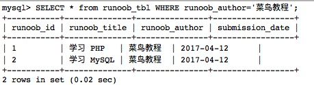
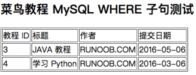

# 第五章：常用语句

## 1. 插入语句(INSERT)

​		MySQL 表中使用 **INSERT INTO** SQL语句来插入数据。

​		你可以通过 `mysql>` 命令提示窗口中向数据表中插入数据，或者通过PHP脚本来插入数据。 

​		以下为向MySQL数据表插入数据通用的 **INSERT INTO**  SQL语法：

```
INSERT INTO table_name ( field1, field2,...fieldN )
                       VALUES
                       ( value1, value2,...valueN );
```

​		添加数据的时候可以规定列进行添加。

 		如果所有的列都要添加数据可以不规定列进行添加数据：

```
mysql> INSERT INTO runoob_tbl
    -> VALUES
    -> (0, "JAVA 教程", "RUNOOB.COM", '2016-05-06');
```

​		如果数据是字符型，必须使用单引号或者双引号，如："value"。

​		INSERT 插入多条数据

```
INSERT INTO table_name  (field1, field2,...fieldN)  
		VALUES  
		(valueA1,valueA2,...valueAN),
		(valueB1,valueB2,...valueBN),
		(valueC1,valueC2,...valueCN)......;
```

### 1.1 通过命令提示窗口插入数据

​		以下我们将使用 SQL  **INSERT INTO** 语句向 MySQL 数据表 runoob_tbl 插入数据 

​		以下实例中我们将向 runoob_tbl 表插入三条数据: 

```mysql
root@host# mysql -u root -p password;
Enter password:*******
mysql> use RUNOOB;
Database changed
mysql> INSERT INTO runoob_tbl 
    -> (runoob_title, runoob_author, submission_date)
    -> VALUES
    -> ("学习 PHP", "菜鸟教程", NOW());
Query OK, 1 rows affected, 1 warnings (0.01 sec)
mysql> INSERT INTO runoob_tbl
    -> (runoob_title, runoob_author, submission_date)
    -> VALUES
    -> ("学习 MySQL", "菜鸟教程", NOW());
Query OK, 1 rows affected, 1 warnings (0.01 sec)
mysql> INSERT INTO runoob_tbl
    -> (runoob_title, runoob_author, submission_date)
    -> VALUES
    -> ("JAVA 教程", "RUNOOB.COM", '2016-05-06');
Query OK, 1 rows affected (0.00 sec)
mysql>
```

> **注意：** 使用箭头标记 -> 不是 SQL 语句的一部分，它仅仅表示一个新行，如果一条SQL语句太长，我们可以通过回车键来创建一个新行来编写 SQL 语句，SQL 语句的命令结束符为分号 ;。 

​		在以上实例中，我们并没有提供 runoob_id 的数据，因为该字段我们在创建表的时候已经设置它为 AUTO_INCREMENT(自动增加) 属性。 所以，该字段会自动递增而不需要我们去设置。实例中 NOW() 是一个 MySQL 函数，该函数返回日期和时间。 

​		接下来我们可以通过以下语句查看数据表数据：

```
select * from runoob_tbl;
```

输出结果：


------

### 1.2 使用PHP脚本插入数据

​		你可以使用PHP 的 mysqli_query() 函数来执行 **SQL INSERT INTO**命令来插入数据。

​		该函数有两个参数，在执行成功时返回 TRUE，否则返回 FALSE。

​		语法如下：

```
mysqli_query(connection,query,resultmode);
```

​		参数如下：

| 参数         | 描述                                                         |
| ------------ | ------------------------------------------------------------ |
| *connection* | 必需。规定要使用的 MySQL 连接。                              |
| *query*      | 必需，规定查询字符串。                                       |
| *resultmode* | 可选。一个常量。可以是下列值中的任意一个：MYSQLI_USE_RESULT（如果需要检索大量数据，请使用这个）MYSQLI_STORE_RESULT（默认） |

​		以下实例中程序接收用户输入的三个字段数据，并插入数据表中：

```php
<?php
$dbhost = 'localhost:3306';  // mysql服务器主机地址
$dbuser = 'root';            // mysql用户名
$dbpass = '123456';          // mysql用户名密码
$conn = mysqli_connect($dbhost, $dbuser, $dbpass);
if(! $conn )
{
  die('连接失败: ' . mysqli_error($conn));
}
echo '连接成功<br />';
// 设置编码，防止中文乱码
mysqli_query($conn , "set names utf8");
 
$runoob_title = '学习 Python';
$runoob_author = 'RUNOOB.COM';
$submission_date = '2016-03-06';
 
$sql = "INSERT INTO runoob_tbl ".
        "(runoob_title,runoob_author, submission_date) ".
        "VALUES ".
        "('$runoob_title','$runoob_author','$submission_date')";
 
 
 
mysqli_select_db( $conn, 'RUNOOB' );
$retval = mysqli_query( $conn, $sql );
if(! $retval )
{
  die('无法插入数据: ' . mysqli_error($conn));
}
echo "数据插入成功\n";
mysqli_close($conn);
?>
```

​		对于含有中文的数据插入，需要添加  mysqli_query($conn , "set names utf8"); 语句。

​		接下来我们可以通过以下语句查看数据表数据：

```
select * from runoob_tbl;
```

​		输出结果：


## 2. 查询语句(SELECT)

​		MySQL 数据库使用SQL SELECT语句来查询数据。

​		你可以通过 `mysql>` 命令提示窗口中在数据库中查询数据，或者通过PHP脚本来查询数据。 

​		以下为在MySQL数据库中查询数据通用的 SELECT 语法： 

```
SELECT column_name,column_name
FROM table_name
[WHERE Clause]
[LIMIT N][ OFFSET M]
```

- 查询语句中你可以使用一个或者多个表，表之间使用逗号(,)分割，并使用WHERE语句来设定查询条件。
- SELECT 命令可以读取一条或者多条记录。
- 你可以使用星号（*）来代替其他字段，SELECT语句会返回表的所有字段数据
- 你可以使用 WHERE 语句来包含任何条件。
- 你可以使用 LIMIT 属性来设定返回的记录数。
- 你可以通过OFFSET指定SELECT语句开始查询的数据偏移量。默认情况下偏移量为0。

------

### 2.1 通过命令提示符获取数据

​		以下实例我们将通过 SQL SELECT 命令来获取 MySQL 数据表 runoob_tbl 的数据： 

```
select * from runoob_tbl;
```

​		该实例将返回数据表 runoob_tbl 的所有记录，输出结果：


------

### 2.2 使用PHP脚本来获取数据

​		使用 PHP 函数的 mysqli_query() 及 SQL SELECT 命令来获取数据。

​		该函数用于执行 SQL 命令，然后通过 PHP 函数 mysqli_fetch_array() 来使用或输出所有查询的数据。

​		mysqli_fetch_array()  函数从结果集中取得一行作为关联数组，或数字数组，或二者兼有 返回根据从结果集取得的行生成的数组，如果没有更多行则返回 false。 

​		以下实例为从数据表 runoob_tbl 中读取所有记录。

```php
<?php
$dbhost = 'localhost:3306';  // mysql服务器主机地址
$dbuser = 'root';            // mysql用户名
$dbpass = '123456';          // mysql用户名密码
$conn = mysqli_connect($dbhost, $dbuser, $dbpass);
if(! $conn )
{
    die('连接失败: ' . mysqli_error($conn));
}
// 设置编码，防止中文乱码
mysqli_query($conn , "set names utf8");
 
$sql = 'SELECT runoob_id, runoob_title, 
        runoob_author, submission_date
        FROM runoob_tbl';
 
mysqli_select_db( $conn, 'RUNOOB' );
$retval = mysqli_query( $conn, $sql );
if(! $retval )
{
    die('无法读取数据: ' . mysqli_error($conn));
}
echo '<h2>菜鸟教程 mysqli_fetch_array 测试<h2>';
echo '<table border="1"><tr><td>教程 ID</td><td>标题</td><td>作者</td><td>提交日期</td></tr>';
while($row = mysqli_fetch_array($retval, MYSQLI_ASSOC))
{
    echo "<tr><td> {$row['runoob_id']}</td> ".
         "<td>{$row['runoob_title']} </td> ".
         "<td>{$row['runoob_author']} </td> ".
         "<td>{$row['submission_date']} </td> ".
         "</tr>";
}
echo '</table>';
mysqli_close($conn);
?>
```

​		输出结果如下所示：

 

​		以上实例中，读取的每行记录赋值给变量 $row，然后再打印出每个值。

> **注意：**记住如果你需要在字符串中使用变量，请将变量置于花括号。

​		在上面的例子中，PHP mysqli_fetch_array() 函数第二个参数为 **MYSQLI_ASSOC**， 设置该参数查询结果返回关联数组，你可以使用字段名称来作为数组的索引。

​		PHP 提供了另外一个函数 **mysqli_fetch_assoc()**, 该函数从结果集中取得一行作为关联数组。 返回根据从结果集取得的行生成的关联数组，如果没有更多行，则返回 false。 

尝试以下实例，该实例使用了 **mysqli_fetch_assoc()** 函数来输出数据表 runoob_tbl 的所有记录：

```php
<?php
$dbhost = 'localhost:3306';  // mysql服务器主机地址
$dbuser = 'root';            // mysql用户名
$dbpass = '123456';          // mysql用户名密码
$conn = mysqli_connect($dbhost, $dbuser, $dbpass);
if(! $conn )
{
    die('连接失败: ' . mysqli_error($conn));
}
// 设置编码，防止中文乱码
mysqli_query($conn , "set names utf8");

$sql = 'SELECT runoob_id, runoob_title, 
        runoob_author, submission_date
        FROM runoob_tbl';

mysqli_select_db( $conn, 'RUNOOB' );
$retval = mysqli_query( $conn, $sql );
if(! $retval )
{
    die('无法读取数据: ' . mysqli_error($conn));
}
echo '<h2>菜鸟教程 mysqli_fetch_assoc 测试<h2>';
echo '<table border="1"><tr><td>教程 ID</td><td>标题</td><td>作者</td><td>提交日期</td></tr>';
while($row = mysqli_fetch_assoc($retval))
{
    echo "<tr><td> {$row['runoob_id']}</td> ".
         "<td>{$row['runoob_title']} </td> ".
         "<td>{$row['runoob_author']} </td> ".
         "<td>{$row['submission_date']} </td> ".
         "</tr>";
}
echo '</table>';
mysqli_close($conn);
?>
```

​		输出结果如下所示：

 

​		你也可以使用常量 MYSQLI_NUM 作为 PHP mysqli_fetch_array() 函数的第二个参数，返回数字数组。 

​		以下实例使用  **MYSQLI_NUM**  参数显示数据表 runoob_tbl 的所有记录: 

```php
<?php
$dbhost = 'localhost:3306';  // mysql服务器主机地址
$dbuser = 'root';            // mysql用户名
$dbpass = '123456';          // mysql用户名密码
$conn = mysqli_connect($dbhost, $dbuser, $dbpass);
if(! $conn )
{
    die('连接失败: ' . mysqli_error($conn));
}
// 设置编码，防止中文乱码
mysqli_query($conn , "set names utf8");

$sql = 'SELECT runoob_id, runoob_title, 
        runoob_author, submission_date
        FROM runoob_tbl';

mysqli_select_db( $conn, 'RUNOOB' );
$retval = mysqli_query( $conn, $sql );
if(! $retval )
{
    die('无法读取数据: ' . mysqli_error($conn));
}
echo '<h2>菜鸟教程 mysqli_fetch_array 测试<h2>';
echo '<table border="1"><tr><td>教程 ID</td><td>标题</td><td>作者</td><td>提交日期</td></tr>';
while($row = mysqli_fetch_array($retval, MYSQLI_NUM))
{
    echo "<tr><td> {$row[0]}</td> ".
         "<td>{$row[1]} </td> ".
         "<td>{$row[2]} </td> ".
         "<td>{$row[3]} </td> ".
         "</tr>";
}
echo '</table>';
mysqli_close($conn);
?>
```

​		输出结果如下所示：

 

​		以上三个实例输出结果都一样。

​		在我们执行完 SELECT 语句后，释放游标内存是一个很好的习惯。 

​		可以通过 PHP 函数 mysqli_free_result() 来实现内存的释放。 

​		以下实例演示了该函数的使用方法。 

```php
<?php
$dbhost = 'localhost:3306';  // mysql服务器主机地址
$dbuser = 'root';            // mysql用户名
$dbpass = '123456';          // mysql用户名密码
$conn = mysqli_connect($dbhost, $dbuser, $dbpass);
if(! $conn )
{
    die('连接失败: ' . mysqli_error($conn));
}
// 设置编码，防止中文乱码
mysqli_query($conn , "set names utf8");

$sql = 'SELECT runoob_id, runoob_title, 
        runoob_author, submission_date
        FROM runoob_tbl';

mysqli_select_db( $conn, 'RUNOOB' );
$retval = mysqli_query( $conn, $sql );
if(! $retval )
{
    die('无法读取数据: ' . mysqli_error($conn));
}
echo '<h2>菜鸟教程 mysqli_fetch_array 测试<h2>';
echo '<table border="1"><tr><td>教程 ID</td><td>标题</td><td>作者</td><td>提交日期</td></tr>';
while($row = mysqli_fetch_array($retval, MYSQLI_NUM))
{
    echo "<tr><td> {$row[0]}</td> ".
         "<td>{$row[1]} </td> ".
         "<td>{$row[2]} </td> ".
         "<td>{$row[3]} </td> ".
         "</tr>";
}
echo '</table>';
// 释放内存
mysqli_free_result($retval);
mysqli_close($conn);
?>
```

​		输出结果如下所示：


## 3. 条件子句(WHERE)

​		我们知道从 MySQL 表中使用 SQL SELECT 语句来读取数据。

​		如需有条件地从表中选取数据，可将 WHERE 子句添加到 SELECT 语句中。

​		以下是 SQL SELECT 语句使用 WHERE 子句从数据表中读取数据的通用语法：

```
SELECT field1, field2,...fieldN FROM table_name1, table_name2...
[WHERE condition1 [AND [OR]] condition2.....
```

- 查询语句中你可以使用一个或者多个表，表之间使用逗号, 分割，并使用WHERE语句来设定查询条件。

- 你可以在 WHERE 子句中指定任何条件。

- 你可以使用 AND 或者 OR 指定一个或多个条件。

- WHERE 子句也可以运用于 SQL 的 DELETE 或者 UPDATE 命令。

- WHERE 子句类似于程序语言中的 if 条件，根据 MySQL 表中的字段值来读取指定的数据。

  ​	以下为操作符列表，可用于 WHERE 子句中。 

  ​	下表中实例假定 A 为 10, B 为 20 

| 操作符 | 描述                                                         | 实例                 |
| ------ | ------------------------------------------------------------ | -------------------- |
| =      | 等号，检测两个值是否相等，如果相等返回true                   | (A = B) 返回false。  |
| <>, != | 不等于，检测两个值是否相等，如果不相等返回true               | (A != B) 返回 true。 |
| >      | 大于号，检测左边的值是否大于右边的值, 如果左边的值大于右边的值返回true | (A > B) 返回false。  |
| <      | 小于号，检测左边的值是否小于右边的值, 如果左边的值小于右边的值返回true | (A < B) 返回 true。  |
| >=     | 大于等于号，检测左边的值是否大于或等于右边的值, 如果左边的值大于或等于右边的值返回true | (A >= B) 返回false。 |
| <=     | 小于等于号，检测左边的值是否小于于或等于右边的值, 如果左边的值小于或等于右边的值返回true | (A <= B) 返回 true。 |

​		如果我们想在 MySQL 数据表中读取指定的数据，WHERE 子句是非常有用的。

​		使用主键来作为 WHERE 子句的条件查询是非常快速的。

​		如果给定的条件在表中没有任何匹配的记录，那么查询不会返回任何数据。

------

### 3.1 从命令提示符中读取数据

​		我们将在SQL SELECT语句使用WHERE子句来读取MySQL数据表 runoob_tbl 中的数据：

​		以下实例将读取 runoob_tbl 表中 runoob_author 字段值为 Sanjay 的所有记录：

```
SELECT * from runoob_tbl WHERE runoob_author='菜鸟教程';
```

​		输出结果：



### 3.2 BINARY 关键字

​		MySQL 的 WHERE 子句的字符串比较是不区分大小写的。 你可以使用 BINARY 关键字来设定 WHERE 子句的字符串比较是区分大小写的。

​		如下实例: 

```mysql
mysql> SELECT * from runoob_tbl WHERE BINARY runoob_author='runoob.com';
Empty set (0.01 sec)
 
mysql> SELECT * from runoob_tbl WHERE BINARY runoob_author='RUNOOB.COM';
+-----------+---------------+---------------+-----------------+
| runoob_id | runoob_title  | runoob_author | submission_date |
+-----------+---------------+---------------+-----------------+
| 3         | JAVA 教程   | RUNOOB.COM    | 2016-05-06      |
| 4         | 学习 Python | RUNOOB.COM    | 2016-03-06      |
+-----------+---------------+---------------+-----------------+
2 rows in set (0.01 sec)
```

​		实例中使用了 **BINARY** 关键字，是区分大小写的，所以 **runoob_author='runoob.com'** 的查询条件是没有数据的。

------

### 3.3 使用PHP脚本读取数据

​		你可以使用 PHP 函数的 mysqli_query() 及相同的 SQL SELECT 带上 WHERE 子句的命令来获取数据。 

​		该函数用于执行 SQL 命令，然后通过 PHP 函数 mysqli_fetch_array() 来输出所有查询的数据。 

​		以下实例将从 runoob_tbl 表中返回使用 runoob_author 字段值为 RUNOOB.COM 的记录： 

```php
<?php
$dbhost = 'localhost:3306';  // mysql服务器主机地址
$dbuser = 'root';            // mysql用户名
$dbpass = '123456';          // mysql用户名密码
$conn = mysqli_connect($dbhost, $dbuser, $dbpass);
if(! $conn )
{
    die('连接失败: ' . mysqli_error($conn));
}
// 设置编码，防止中文乱码
mysqli_query($conn , "set names utf8");

// 读取 runoob_author 为 RUNOOB.COM 的数据
$sql = 'SELECT runoob_id, runoob_title, 
        runoob_author, submission_date
        FROM runoob_tbl
        WHERE runoob_author="RUNOOB.COM"';

mysqli_select_db( $conn, 'RUNOOB' );
$retval = mysqli_query( $conn, $sql );
if(! $retval )
{
    die('无法读取数据: ' . mysqli_error($conn));
}
echo '<h2>菜鸟教程 MySQL WHERE 子句测试<h2>';
echo '<table border="1"><tr><td>教程 ID</td><td>标题</td><td>作者</td><td>提交日期</td></tr>';
while($row = mysqli_fetch_array($retval, MYSQLI_ASSOC))
{
    echo "<tr><td> {$row['runoob_id']}</td> ".
         "<td>{$row['runoob_title']} </td> ".
         "<td>{$row['runoob_author']} </td> ".
         "<td>{$row['submission_date']} </td> ".
         "</tr>";
}
echo '</table>';
// 释放内存
mysqli_free_result($retval);
mysqli_close($conn);
?>
```

​		输出结果如下所示：



## 4. 更新语句(UPDATE) 

​		如果我们需要修改或更新 MySQL 中的数据，我们可以使用 SQL UPDATE 命令来操作。 

​		以下是 UPDATE 命令修改 MySQL 数据表数据的通用 SQL 语法：

```
UPDATE table_name SET field1=new-value1, field2=new-value2
[WHERE Clause]
```

- 你可以同时更新一个或多个字段。

- 你可以在 WHERE 子句中指定任何条件。

- 你可以在一个单独表中同时更新数据。

  ​	当你需要更新数据表中指定行的数据时 WHERE 子句是非常有用的。 

------

### 4.1 通过命令提示符更新数据 

​		以下我们将在  SQL UPDATE  命令使用 WHERE 子句来更新 runoob_tbl 表中指定的数据：

```mysql
mysql> UPDATE runoob_tbl SET runoob_title='学习 C++' WHERE runoob_id=3;
Query OK, 1 rows affected (0.01 sec)
 
mysql> SELECT * from runoob_tbl WHERE runoob_id=3;
+-----------+--------------+---------------+-----------------+
| runoob_id | runoob_title | runoob_author | submission_date |
+-----------+--------------+---------------+-----------------+
| 3         | 学习 C++   | RUNOOB.COM    | 2016-05-06      |
+-----------+--------------+---------------+-----------------+
1 rows in set (0.01 sec)
```

​		从结果上看，runoob_id 为 3 的 runoob_title 已被修改。

------

### 4.2 使用PHP脚本更新数据

​		PHP 中使用函数 mysqli_query() 来执行 SQL 语句，你可以在 SQL UPDATE 语句中使用或者不使用 WHERE 子句。 

> **注意：**不使用 WHERE 子句将数据表的全部数据进行更新，所以要慎重。

​		该函数与在 `mysql>` 命令提示符中执行 SQL 语句的效果是一样的。 

​		以下实例将更新 runoob_id 为 3 的 runoob_title 字段的数据。 

```php
<?php
$dbhost = 'localhost:3306';  // mysql服务器主机地址
$dbuser = 'root';            // mysql用户名
$dbpass = '123456';          // mysql用户名密码
$conn = mysqli_connect($dbhost, $dbuser, $dbpass);
if(! $conn )
{
    die('连接失败: ' . mysqli_error($conn));
}
// 设置编码，防止中文乱码
mysqli_query($conn , "set names utf8");
 
$sql = 'UPDATE runoob_tbl
        SET runoob_title="学习 Python"
        WHERE runoob_id=3';
 
mysqli_select_db( $conn, 'RUNOOB' );
$retval = mysqli_query( $conn, $sql );
if(! $retval )
{
    die('无法更新数据: ' . mysqli_error($conn));
}
echo '数据更新成功！';
mysqli_close($conn);
```

## 5. 删除语句(DELETE) 

​		 你可以使用 SQL 的 DELETE FROM 命令来删除 MySQL 数据表中的记录。 

 		你可以在 `mysql>` 命令提示符或 PHP 脚本中执行该命令。 

​		 以下是 SQL DELETE 语句从 MySQL 数据表中删除数据的通用语法：

```
DELETE FROM table_name [WHERE Clause]
```

-  如果没有指定 WHERE 子句，MySQL 表中的所有记录将被删除。

-   你可以在 WHERE 子句中指定任何条件

-  您可以在单个表中一次性删除记录。

  ​	 当你想删除数据表中指定的记录时 WHERE 子句是非常有用的。 

### 5.1 从命令行中删除数据

​		这里我们将在 SQL DELETE 命令中使用 WHERE 子句来删除 MySQL 数据表 runoob_tbl 所选的数据。

​		以下实例将删除 runoob_tbl 表中 runoob_id 为3 的记录：

```mysql
mysql> use RUNOOB;
Database changed
mysql> DELETE FROM runoob_tbl WHERE runoob_id=3;
Query OK, 1 row affected (0.23 sec)
```

------

### 5.2 使用 PHP 脚本删除数据

​		PHP使用 mysqli_query() 函数来执行SQL语句， 你可以在 SQL DELETE 命令中使用或不使用 WHERE 子句。

​		该函数与 `mysql>` 命令符执行SQL命令的效果是一样的。

​		以下PHP实例将删除 runoob_tbl 表中 runoob_id 为 3 的记录:

```php
<?php
$dbhost = 'localhost:3306';  // mysql服务器主机地址
$dbuser = 'root';            // mysql用户名
$dbpass = '123456';          // mysql用户名密码
$conn = mysqli_connect($dbhost, $dbuser, $dbpass);
if(! $conn )
{
    die('连接失败: ' . mysqli_error($conn));
}
// 设置编码，防止中文乱码
mysqli_query($conn , "set names utf8");
 
$sql = 'DELETE FROM runoob_tbl
        WHERE runoob_id=3';
 
mysqli_select_db( $conn, 'RUNOOB' );
$retval = mysqli_query( $conn, $sql );
if(! $retval )
{
    die('无法删除数据: ' . mysqli_error($conn));
}
echo '数据删除成功！';
mysqli_close($conn);
?>
```

## 6.模糊查询子句(LIKE)

​		我们知道在 MySQL 中使用 SQL SELECT 命令来读取数据， 同时我们可以在 SELECT 语句中使用 WHERE 子句来获取指定的记录。

​		WHERE 子句中可以使用等号 = 来设定获取数据的条件，如 "runoob_author = 'RUNOOB.COM'"。

​		但是有时候我们需要获取 runoob_author 字段含有 "COM" 字符的所有记录，这时我们就需要在 WHERE 子句中使用 SQL LIKE 子句。  

​		SQL LIKE 子句中使用百分号 %字符来表示任意字符，类似于UNIX或正则表达式中的星号 *。

​		如果没有使用百分号 %, LIKE 子句与等号 = 的效果是一样的。 

​		以下是 SQL SELECT 语句使用 LIKE 子句从数据表中读取数据的通用语法：

```
SELECT field1, field2,...fieldN 
FROM table_name
WHERE field1 LIKE condition1 [AND [OR]] filed2 = 'somevalue'
```

- 你可以在 WHERE 子句中指定任何条件。
- 你可以在 WHERE 子句中使用LIKE子句。
- 你可以使用LIKE子句代替等号 =。
-  LIKE 通常与 % 一同使用，类似于一个元字符的搜索。
- 你可以使用 AND 或者 OR 指定一个或多个条件。
- 你可以在 DELETE 或 UPDATE 命令中使用  WHERE...LIKE 子句来指定条件。

在 where like 的条件查询中，SQL 提供了四种匹配方式。

1. **%**：表示任意 0 个或多个字符。可匹配任意类型和长度的字符，有些情况下若是中文，请使用两个百分号（%%）表示。
2. **_**：表示任意单个字符。匹配单个任意字符，它常用来限制表达式的字符长度语句。
3. **[]**：表示括号内所列字符中的一个（类似正则表达式）。指定一个字符、字符串或范围，要求所匹配对象为它们中的任一个。
4. **[^]** ：表示不在括号所列之内的单个字符。其取值和 [] 相同，但它要求所匹配对象为指定字符以外的任一个字符。
5. 查询内容包含通配符时,由于通配符的缘故，导致我们查询特殊字符 “%”、“_”、“[” 的语句无法正常实现，而把特殊字符用 “[ ]” 括起便可正常查询。

   ​	like 匹配/模糊匹配，会与 **%** 和 **_** 结合使用。

```
'%a'     //以a结尾的数据
'a%'     //以a开头的数据
'%a%'    //含有a的数据
'_a_'    //三位且中间字母是a的
'_a'     //两位且结尾字母是a的
'a_'     //两位且开头字母是a的
```

 		查询以 java 字段开头的信息:

```
SELECT * FROM position WHERE name LIKE 'java%';
```

​		查询包含 java 字段的信息:

```
SELECT * FROM position WHERE name LIKE '%java%';
```

​		查询以 java 字段结尾的信息:

```
SELECT * FROM position WHERE name LIKE '%java';
```

------

### 6.1 在命令提示符中使用 LIKE 子句

​		我们将在 SQL SELECT 命令中使用 WHERE...LIKE 子句来从MySQL数据表 runoob_tbl 中读取数据。

​		以下是我们将 runoob_tbl 表中获取 runoob_author 字段中以 COM 为结尾的的所有记录：

```mysql
mysql> use RUNOOB;
Database changed
mysql> SELECT * from runoob_tbl  WHERE runoob_author LIKE '%COM';
+-----------+---------------+---------------+-----------------+
| runoob_id | runoob_title  | runoob_author | submission_date |
+-----------+---------------+---------------+-----------------+
| 3         | 学习 Java   | RUNOOB.COM    | 2015-05-01      |
| 4         | 学习 Python | RUNOOB.COM    | 2016-03-06      |
+-----------+---------------+---------------+-----------------+
2 rows in set (0.01 sec)
```

------

### 6.2 在PHP脚本中使用 LIKE 子句

​		你可以使用PHP函数的 mysqli_query() 及相同的 SQL SELECT 带上 WHERE...LIKE  子句的命令来获取数据。 

​		该函数用于执行 SQL 命令，然后通过 PHP 函数 mysqli_fetch_array() 来输出所有查询的数据。 

​		但是如果是 DELETE 或者 UPDATE 中使用 WHERE...LIKE 子句的S QL 语句，则无需使用 mysqli_fetch_array() 函数。 

​		以下是我们使用PHP脚本在 runoob_tbl 表中读取 runoob_author 字段中以 COM 为结尾的的所有记录：

```php
<?php
$dbhost = 'localhost:3306';  // mysql服务器主机地址
$dbuser = 'root';            // mysql用户名
$dbpass = '123456';          // mysql用户名密码
$conn = mysqli_connect($dbhost, $dbuser, $dbpass);
if(! $conn )
{
    die('连接失败: ' . mysqli_error($conn));
}
// 设置编码，防止中文乱码
mysqli_query($conn , "set names utf8");

$sql = 'SELECT runoob_id, runoob_title, 
        runoob_author, submission_date
        FROM runoob_tbl
        WHERE runoob_author LIKE "%COM"';

mysqli_select_db( $conn, 'RUNOOB' );
$retval = mysqli_query( $conn, $sql );
if(! $retval )
{
    die('无法读取数据: ' . mysqli_error($conn));
}
echo '<h2>菜鸟教程 mysqli_fetch_array 测试<h2>';
echo '<table border="1"><tr><td>教程 ID</td><td>标题</td><td>作者</td><td>提交日期</td></tr>';
while($row = mysqli_fetch_array($retval, MYSQLI_ASSOC))
{
    echo "<tr><td> {$row['runoob_id']}</td> ".
         "<td>{$row['runoob_title']} </td> ".
         "<td>{$row['runoob_author']} </td> ".
         "<td>{$row['submission_date']} </td> ".
         "</tr>";
}
echo '</table>';
mysqli_close($conn);
?>
```

​		输出结果如下图所示：


## 7. 联合查询(UNION)

​		本教程为大家介绍 MySQL UNION 操作符的语法和实例。

​		MySQL UNION 操作符用于连接两个以上的 SELECT 语句的结果组合到一个结果集合中。多个 SELECT 语句会删除重复的数据。

MySQL UNION 操作符语法格式：

```
SELECT expression1, expression2, ... expression_n
FROM tables
[WHERE conditions]
UNION [ALL | DISTINCT]
SELECT expression1, expression2, ... expression_n
FROM tables
[WHERE conditions];
```

​		参数如下：

- **expression1, expression2, ... expression_n**: 要检索的列。

- **tables:** 要检索的数据表。

- **WHERE conditions:** 可选， 检索条件。

- **DISTINCT:** 可选，删除结果集中重复的数据。默认情况下 UNION 操作符已经删除了重复数据，所以 DISTINCT 修饰符对结果没啥影响。

- **ALL:** 可选，返回所有结果集，包含重复数据。

  ​	在本教程中，我们将使用 RUNOOB 样本数据库。

  ​	下面是选自 "Websites" 表的数据：

```mysql
mysql> SELECT * FROM Websites;
+----+--------------+---------------------------+-------+---------+
| id | name         | url                       | alexa | country |
+----+--------------+---------------------------+-------+---------+
| 1  | Google       | https://www.google.cm/    | 1     | USA     |
| 2  | 淘宝          | https://www.taobao.com/   | 13    | CN      |
| 3  | 菜鸟教程      | http://www.runoob.com/    | 4689  | CN      |
| 4  | 微博          | http://weibo.com/         | 20    | CN      |
| 5  | Facebook     | https://www.facebook.com/ | 3     | USA     |
| 7  | stackoverflow | http://stackoverflow.com/ |   0 | IND     |
+----+---------------+---------------------------+-------+---------+
```

​		下面是 "apps" APP 的数据：

```mysql
mysql> SELECT * FROM apps;
+----+------------+-------------------------+---------+
| id | app_name   | url                     | country |
+----+------------+-------------------------+---------+
|  1 | QQ APP     | http://im.qq.com/       | CN      |
|  2 | 微博 APP | http://weibo.com/       | CN      |
|  3 | 淘宝 APP | https://www.taobao.com/ | CN      |
+----+------------+-------------------------+---------+
3 rows in set (0.00 sec)
```

------

### 7.1 SQL UNION 实例

​		下面的 SQL 语句从 "Websites" 和 "apps" 表中选取所有**不同的**country（只有不同的值）：

```mysql
SELECT country FROM Websites
UNION
SELECT country FROM apps
ORDER BY country; SELECT country FROM Websites
UNION
SELECT country FROM apps
ORDER BY country; 
```

​		执行以上 SQL 输出结果如下：

 

> **注释：**UNION 不能用于列出两个表中所有的country。如果一些网站和APP来自同一个国家，每个国家只会列出一次。UNION 只会选取不同的值。请使用 UNION ALL 来选取重复的值！

------

### 7.2 SQL UNION ALL 实例

​		下面的 SQL 语句使用 UNION ALL 从 "Websites" 和 "apps" 表中选取**所有的**country（也有重复的值）：

```mysql
SELECT country FROM Websites
UNION ALL
SELECT country FROM apps
ORDER BY country; 
```

​		执行以上 SQL 输出结果如下：

 

------

### 7.3 带有 WHERE 的 SQL UNION ALL

​		下面的 SQL 语句使用 UNION ALL 从 "Websites" 和 "apps" 表中选取**所有的**中国(CN)的数据（也有重复的值）：

```mysql
SELECT country, name FROM Websites
WHERE country='CN'
UNION ALL
SELECT country, app_name FROM apps
WHERE country='CN'
ORDER BY country; 
```

​		执行以上 SQL 输出结果如下：


## 8. 排序(ORDER BY)

​		我们知道从 MySQL 表中使用 SQL SELECT 语句来读取数据。

​		如果我们需要对读取的数据进行排序，我们就可以使用 MySQL 的 **ORDER BY** 子句来设定你想按哪个字段哪种方式来进行排序，再返回搜索结果。 

​		以下是 SQL SELECT 语句使用 ORDER BY 子句将查询数据排序后再返回数据： 

```
SELECT field1, field2,...fieldN FROM table_name1, table_name2...
ORDER BY field1 [ASC [DESC][默认 ASC]], [field2...] [ASC [DESC][默认 ASC]]
```

- 你可以使用任何字段来作为排序的条件，从而返回排序后的查询结果。
- 你可以设定多个字段来排序。
- 你可以使用 ASC 或 DESC 关键字来设置查询结果是按升序或降序排列。 默认情况下，它是按升序排列。
- 你可以添加 WHERE...LIKE 子句来设置条件。

------

### 8.1 在命令提示符中使用 ORDER BY 子句

​		以下将在 SQL SELECT 语句中使用 ORDER BY 子句来读取MySQL 数据表 runoob_tbl 中的数据：

```mysql
mysql> use RUNOOB;
Database changed
mysql> SELECT * from runoob_tbl ORDER BY submission_date ASC;
+-----------+---------------+---------------+-----------------+
| runoob_id | runoob_title  | runoob_author | submission_date |
+-----------+---------------+---------------+-----------------+
| 3         | 学习 Java   | RUNOOB.COM    | 2015-05-01      |
| 4         | 学习 Python | RUNOOB.COM    | 2016-03-06      |
| 1         | 学习 PHP    | 菜鸟教程  | 2017-04-12      |
| 2         | 学习 MySQL  | 菜鸟教程  | 2017-04-12      |
+-----------+---------------+---------------+-----------------+
4 rows in set (0.01 sec)
 
mysql> SELECT * from runoob_tbl ORDER BY submission_date DESC;
+-----------+---------------+---------------+-----------------+
| runoob_id | runoob_title  | runoob_author | submission_date |
+-----------+---------------+---------------+-----------------+
| 1         | 学习 PHP    | 菜鸟教程  | 2017-04-12      |
| 2         | 学习 MySQL  | 菜鸟教程  | 2017-04-12      |
| 4         | 学习 Python | RUNOOB.COM    | 2016-03-06      |
| 3         | 学习 Java   | RUNOOB.COM    | 2015-05-01      |
+-----------+---------------+---------------+-----------------+
4 rows in set (0.01 sec)
```

​		读取 runoob_tbl 表中所有数据并按  submission_date 字段的升序排列。

**MySQL 拼音排序**

​		如果字符集采用的是 gbk(汉字编码字符集)，直接在查询语句后边添加 ORDER BY：

```
SELECT * 
FROM runoob_tbl
ORDER BY runoob_title;
```

​		如果字符集采用的是 utf8(万国码)，需要先对字段进行转码然后排序：

```
SELECT * 
FROM runoob_tbl
ORDER BY CONVERT(runoob_title using gbk);
```

------

### 8.2 在 PHP 脚本中使用 ORDER BY 子句

​		你可以使用PHP函数的 mysqli_query() 及相同的 SQL SELECT 带上 ORDER BY 子句的命令来获取数据。

​		该函数用于执行 SQL 命令，然后通过 PHP 函数 mysqli_fetch_array() 来输出所有查询的数据。

​		尝试以下实例，查询后的数据按  submission_date 字段的降序排列后返回。

```php
<?php
$dbhost = 'localhost:3306';  // mysql服务器主机地址
$dbuser = 'root';            // mysql用户名
$dbpass = '123456';          // mysql用户名密码
$conn = mysqli_connect($dbhost, $dbuser, $dbpass);
if(! $conn )
{
    die('连接失败: ' . mysqli_error($conn));
}
// 设置编码，防止中文乱码
mysqli_query($conn , "set names utf8");

$sql = 'SELECT runoob_id, runoob_title, 
        runoob_author, submission_date
        FROM runoob_tbl
        ORDER BY  submission_date ASC';

mysqli_select_db( $conn, 'RUNOOB' );
$retval = mysqli_query( $conn, $sql );
if(! $retval )
{
    die('无法读取数据: ' . mysqli_error($conn));
}
echo '<h2>菜鸟教程 MySQL ORDER BY 测试<h2>';
echo '<table border="1"><tr><td>教程 ID</td><td>标题</td><td>作者</td><td>提交日期</td></tr>';
while($row = mysqli_fetch_array($retval, MYSQL_ASSOC))
{
    echo "<tr><td> {$row['runoob_id']}</td> ".
         "<td>{$row['runoob_title']} </td> ".
         "<td>{$row['runoob_author']} </td> ".
         "<td>{$row['submission_date']} </td> ".
         "</tr>";
}
echo '</table>';
mysqli_close($conn);
?>
```

输出结果如下图所示：


## 9. 分组(GROUP BY)

​		GROUP BY 语句根据一个或多个列对结果集进行分组。

​		在分组的列上我们可以使用 COUNT, SUM, AVG,等函数。 

​		GROUP BY 语法如下：

```
SELECT column_name, function(column_name)
FROM table_name
WHERE column_name operator value
GROUP BY column_name;
```

​		本章节实例使用到了以下表结构及数据，使用前我们可以先将以下数据导入数据库中。

```mysql
SET NAMES utf8;
SET FOREIGN_KEY_CHECKS = 0;

-- ----------------------------
--  Table structure for `employee_tbl`
-- ----------------------------
DROP TABLE IF EXISTS `employee_tbl`;
CREATE TABLE `employee_tbl` (
  `id` int(11) NOT NULL,
  `name` char(10) NOT NULL DEFAULT '',
  `date` datetime NOT NULL,
  `singin` tinyint(4) NOT NULL DEFAULT '0' COMMENT '登录次数',
  PRIMARY KEY (`id`)
) ENGINE=InnoDB DEFAULT CHARSET=utf8;

-- ----------------------------
--  Records of `employee_tbl`
-- ----------------------------
BEGIN;
INSERT INTO `employee_tbl` VALUES ('1', '小明', '2016-04-22 15:25:33', '1'), ('2', '小王', '2016-04-20 15:25:47', '3'), ('3', '小丽', '2016-04-19 15:26:02', '2'), ('4', '小王', '2016-04-07 15:26:14', '4'), ('5', '小明', '2016-04-11 15:26:40', '4'), ('6', '小明', '2016-04-04 15:26:54', '2');
COMMIT;

SET FOREIGN_KEY_CHECKS = 1;
```

​		导入成功后，执行以下 SQL 语句：

```mysql
mysql> set names utf8;
mysql> SELECT * FROM employee_tbl;
+----+--------+---------------------+--------+
| id | name   | date                | singin |
+----+--------+---------------------+--------+
|  1 | 小明 | 2016-04-22 15:25:33 |      1 |
|  2 | 小王 | 2016-04-20 15:25:47 |      3 |
|  3 | 小丽 | 2016-04-19 15:26:02 |      2 |
|  4 | 小王 | 2016-04-07 15:26:14 |      4 |
|  5 | 小明 | 2016-04-11 15:26:40 |      4 |
|  6 | 小明 | 2016-04-04 15:26:54 |      2 |
+----+--------+---------------------+--------+
6 rows in set (0.00 sec)
```

​		接下来我们使用 GROUP BY 语句 将数据表按名字进行分组，并统计每个人有多少条记录：

```mysql
mysql> SELECT name, COUNT(*) FROM   employee_tbl GROUP BY name;
+--------+----------+
| name   | COUNT(*) |
+--------+----------+
| 小丽 |        1 |
| 小明 |        3 |
| 小王 |        2 |
+--------+----------+
3 rows in set (0.01 sec)
```

### 9.1 使用 WITH ROLLUP

​		WITH ROLLUP 可以实现在分组统计数据基础上再进行相同的统计（SUM,AVG,COUNT…）。

​		例如我们将以上的数据表按名字进行分组，再统计每个人登录的次数：

```mysql
mysql> SELECT name, SUM(singin) as singin_count FROM  employee_tbl GROUP BY name WITH ROLLUP;
+--------+--------------+
| name   | singin_count |
+--------+--------------+
| 小丽 |            2 |
| 小明 |            7 |
| 小王 |            7 |
| NULL   |           16 |
+--------+--------------+
4 rows in set (0.00 sec)
```

​		其中记录 NULL  表示所有人的登录次数。

​		我们可以使用 coalesce 来设置一个可以取代 NUll 的名称，coalesce 语法：

```
select coalesce(a,b,c);
```

​		参数说明：如果a==null,则选择b；如果b==null,则选择c；如果a!=null,则选择a；如果a b c 都为null ，则返回为null（没意义）。

​		以下实例中如果名字为空我们使用总数代替：

```mysql
mysql> SELECT coalesce(name, '总数'), SUM(singin) as singin_count FROM  employee_tbl GROUP BY name WITH ROLLUP;
+--------------------------+--------------+
| coalesce(name, '总数') | singin_count |
+--------------------------+--------------+
| 小丽                   |            2 |
| 小明                   |            7 |
| 小王                   |            7 |
| 总数                   |           16 |
+--------------------------+--------------+
4 rows in set (0.01 sec)
```

## 10. 连接(JOIN)

​		在前几章节中，我们已经学会了如何在一张表中读取数据，这是相对简单的，但是在真正的应用中经常需要从多个数据表中读取数据。

​		本章节我们将向大家介绍如何使用 MySQL 的 JOIN 在两个或多个表中查询数据。

​		你可以在 SELECT, UPDATE 和 DELETE 语句中使用 Mysql 的 JOIN 来联合多表查询。

​		JOIN 按照功能大致分为如下三类： 

- **INNER JOIN/JOIN（内连接,或等值连接）**：获取两个表中字段匹配关系的记录。
- **LEFT JOIN（左连接）：**获取左表所有记录，即使右表没有对应匹配的记录。
- **RIGHT JOIN（右连接）：** 与 LEFT JOIN 相反，用于获取右表所有记录，即使左表没有对应匹配的记录。

------

### 10.1 在命令提示符中使用 INNER JOIN

​		我们在RUNOOB数据库中有两张表 tcount_tbl 和 runoob_tbl。两张数据表数据如下：

​		尝试以下实例：

```mysql
mysql> use RUNOOB;
Database changed
mysql> SELECT * FROM tcount_tbl;
+---------------+--------------+
| runoob_author | runoob_count |
+---------------+--------------+
| 菜鸟教程  | 10           |
| RUNOOB.COM    | 20           |
| Google        | 22           |
+---------------+--------------+
3 rows in set (0.01 sec)
 
mysql> SELECT * from runoob_tbl;
+-----------+---------------+---------------+-----------------+
| runoob_id | runoob_title  | runoob_author | submission_date |
+-----------+---------------+---------------+-----------------+
| 1         | 学习 PHP    | 菜鸟教程  | 2017-04-12      |
| 2         | 学习 MySQL  | 菜鸟教程  | 2017-04-12      |
| 3         | 学习 Java   | RUNOOB.COM    | 2015-05-01      |
| 4         | 学习 Python | RUNOOB.COM    | 2016-03-06      |
| 5         | 学习 C      | FK            | 2017-04-05      |
+-----------+---------------+---------------+-----------------+
5 rows in set (0.01 sec)
```

​		接下来我们就使用MySQL的**INNER JOIN(也可以省略 INNER 使用 JOIN，效果一样)**来连接以上两张表来读取		runoob_tbl表中所有runoob_author字段在tcount_tbl表对应的runoob_count字段值：

### 10.2 INNER JOIN

```mysql
mysql> SELECT a.runoob_id, a.runoob_author, b.runoob_count FROM runoob_tbl a INNER JOIN tcount_tbl b ON a.runoob_author = b.runoob_author;
+-------------+-----------------+----------------+
| a.runoob_id | a.runoob_author | b.runoob_count |
+-------------+-----------------+----------------+
| 1           | 菜鸟教程    | 10             |
| 2           | 菜鸟教程    | 10             |
| 3           | RUNOOB.COM      | 20             |
| 4           | RUNOOB.COM      | 20             |
+-------------+-----------------+----------------+
4 rows in set (0.00 sec)
```

以上 SQL 语句等价于：

```mysql
mysql> SELECT a.runoob_id, a.runoob_author, b.runoob_count FROM runoob_tbl a, tcount_tbl b WHERE a.runoob_author = b.runoob_author;
+-------------+-----------------+----------------+
| a.runoob_id | a.runoob_author | b.runoob_count |
+-------------+-----------------+----------------+
| 1           | 菜鸟教程    | 10             |
| 2           | 菜鸟教程    | 10             |
| 3           | RUNOOB.COM      | 20             |
| 4           | RUNOOB.COM      | 20             |
+-------------+-----------------+----------------+
4 rows in set (0.01 sec)
```


------

### 10.3 LEFT JOIN

​		MySQL left join 与 join 有所不同。  MySQL LEFT JOIN 会读取左边数据表的全部数据，即便右边表无对应数据。

​		尝试以下实例，以 **runoob_tbl** 为左表，**tcount_tbl** 为右表，理解 MySQL LEFT JOIN 的应用：

```mysql
mysql> SELECT a.runoob_id, a.runoob_author, b.runoob_count FROM runoob_tbl a LEFT JOIN tcount_tbl b ON a.runoob_author = b.runoob_author;
+-------------+-----------------+----------------+
| a.runoob_id | a.runoob_author | b.runoob_count |
+-------------+-----------------+----------------+
| 1           | 菜鸟教程    | 10             |
| 2           | 菜鸟教程    | 10             |
| 3           | RUNOOB.COM      | 20             |
| 4           | RUNOOB.COM      | 20             |
| 5           | FK              | NULL           |
+-------------+-----------------+----------------+
5 rows in set (0.01 sec)
```

​		以上实例中使用了 LEFT JOIN，该语句会读取左边的数据表 runoob_tbl 的所有选取的字段数据，即便在右侧表 tcount_tbl中 没有对应的 runoob_author 字段值。


------

### 10.4 RIGHT JOIN

​		MySQL RIGHT JOIN 会读取右边数据表的全部数据，即便左边边表无对应数据。

​		尝试以下实例，以 **runoob_tbl** 为左表，**tcount_tbl** 为右表，理解MySQL RIGHT JOIN的应用：

```mysql
mysql> SELECT a.runoob_id, a.runoob_author, b.runoob_count FROM runoob_tbl a RIGHT JOIN tcount_tbl b ON a.runoob_author = b.runoob_author;
+-------------+-----------------+----------------+
| a.runoob_id | a.runoob_author | b.runoob_count |
+-------------+-----------------+----------------+
| 1           | 菜鸟教程    | 10             |
| 2           | 菜鸟教程    | 10             |
| 3           | RUNOOB.COM      | 20             |
| 4           | RUNOOB.COM      | 20             |
| NULL        | NULL            | 22             |
+-------------+-----------------+----------------+
5 rows in set (0.01 sec)
```

以上实例中使用了 RIGHT JOIN，该语句会读取右边的数据表 tcount_tbl 的所有选取的字段数据，即便在左侧表 runoob_tbl 中没有对应的runoob_author 字段值。


------

### 10.5 在 PHP 脚本中使用 JOIN

PHP 中使用 mysqli_query() 函数来执行 SQL 语句，你可以使用以上的相同的 SQL 语句作为 mysqli_query() 函数的参数。

尝试如下实例:

```php
<?php
$dbhost = 'localhost:3306';  // mysql服务器主机地址
$dbuser = 'root';            // mysql用户名
$dbpass = '123456';          // mysql用户名密码
$conn = mysqli_connect($dbhost, $dbuser, $dbpass);
if(! $conn )
{
    die('连接失败: ' . mysqli_error($conn));
}
// 设置编码，防止中文乱码
mysqli_query($conn , "set names utf8");

$sql = 'SELECT a.runoob_id, a.runoob_author, b.runoob_count FROM runoob_tbl a INNER JOIN tcount_tbl b ON a.runoob_author = b.runoob_author';

mysqli_select_db( $conn, 'RUNOOB' );
$retval = mysqli_query( $conn, $sql );
if(! $retval )
{
    die('无法读取数据: ' . mysqli_error($conn));
}
echo '<h2>菜鸟教程 MySQL JOIN 测试<h2>';
echo '<table border="1"><tr><td>教程 ID</td><td>作者</td><td>登陆次数</td></tr>';
while($row = mysqli_fetch_array($retval, MYSQLI_ASSOC))
{
    echo "<tr><td> {$row['runoob_id']}</td> ".
         "<td>{$row['runoob_author']} </td> ".
         "<td>{$row['runoob_count']} </td> ".
         "</tr>";
}
echo '</table>';
mysqli_close($conn);
?>
```

输出结果如下图所示：

