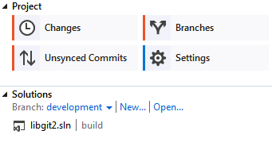

# 附录A：其他环境中的Git

​		从头至尾读到了这里，你肯定已经掌握了不少使用 Git 命令行操作的知识。 你学会了操作本地文件，通过网络连接你的仓库，以及与他人进行有效率的合作。 但是故事并未就此结束；Git 通常只是更大的生态圈的一部分，在某些情况下使用终端并不是最合适的方式。 现在就让我们来了解一下如何在其它类型的环境中更好地使用 Git，以及别的应用（包括你的）如何与 Git 进行协作。

## 1. 图形界面

​		Git 的原生环境是终端。 在那里，你可以体验到最新的功能，也只有在那里，你才能尽情发挥 Git 的全部能力。 但是对于某些任务而言，纯文本并不是最佳的选择；有时候你确实需要一个可视化的展示方式，而且有些用户更习惯那种能点击的界面。

有一点请注意，不同的界面是为不同的工作流程设计的。 一些客户端的作者为了支持某种他认为高效的工作流程，经过精心挑选，只显示了 Git 功能的一个子集。 每种工具都有其特定的目的和意义，从这个角度来看，不能说某种工具比其它的“更好”。 还有请注意，没有什么事情是图形界面客户端可以做而命令行客户端不能做的；命令行始终是你可以完全操控仓库并发挥出全部力量的地方。

### 1.1 `gitk` 和 `git-gui`

​		在安装 Git 的同时，你也装好了它提供的可视化工具，`gitk` 和 `git-gui`。

​		`gitk` 是一个历史记录的图形化查看器。 你可以把它当作是基于 `git log` 和 `git grep` 命令的一个强大的图形操作界面。 当你需要查找过去发生的某次记录，或是可视化查看项目历史的时候，你将会用到这个工具。

使用 Gitk 的最简单方法就是从命令行打开。 只需 `cd` 到一个 Git 仓库，然后键入：

```console
$ gitk [git log options]
```

​		Gitk 可以接受很多命令行选项，其中的大部分都直接传给底层的 `git log` 去执行了。 `--all` 可能是这其中最有用的一个, 它告诉 gitk 去尽可能地从 *任何* 引用查找提交并显示，而不仅仅是从 HEAD。 Gitk 的界面看起来长这样：


`gitk` 历史查看器。

​		这张图看起来就和执行 `git log --graph` 命令的输出差不多；每个点代表一次提交，线代表父子关系，而彩色的方块则用来标示一个个引用。 黄点表示 HEAD，红点表示尚未提交的本地变动。 下方的窗口用来显示当前选中的提交的具体信息；评论和补丁显示在左侧，摘要显示在右侧。 中间则是一组用来搜索历史的控件。

​		与之相比，`git-gui` 则主要是一个用来制作提交的工具。 打开它的最简单方法也是从命令行启动：

```console
$ git gui
```

​		它的界面长这个样子：


`git-gui` 提交工具。

​		左侧是索引区；未暂存的修改显示在上方，已暂存的修改显示在下方。 你可以通过点击文件名左侧的图标来将该文件在暂存状态与未暂存状态之间切换，你也可以通过选中一个文件名来查看它的详情。

​		右侧窗口的上方以 diff 格式来显示当前选中文件发生了变动的地方。 你可以通过右击某一区块或行从而将这一区块或行放入暂存区。

​		右侧窗口的下方是写日志和执行操作的地方。 在文本框中键入日志然后点击“提交”就和执行 `git commit` 的效果差不多。 如果你想要修订上一次提交, 可以选中“修订”按钮，上次一提交的内容就会显示在“暂存区”。 然后你就可以简单的对修改进行暂存和取消暂存操作，更新提交日志，然后再次点击“提交”用这个新的提交来覆盖上一次提交。

​		`gitk` 和 `git-gui` 就是针对某种任务设计的工具的两个例子。 它们分别为了不同的目的（即查看历史和制作提交）而进行了精简，略去了用不到的功能。

### 1.2 Mac 和 Windows 上的 GitHub 客户端

​		GitHub 发布了两个面向工作流程的 Git 客户端：Windows 版，和 Mac 版。 它们很好的展示了一个面向工作流程的工具应该是什么样子——专注于提升那些常用的功能及其协作的可用性，而不是实现 Git 的 *所有* 功能. 它们看起来长这个样子：


 GitHub Mac 客户端。


GitHub Windows 客户端。

​		我们在设计的时候就努力将二者的外观和操作体验都保持一致，因此本章会把他们当做同一个产品来介绍。 我们并不会详细地介绍该工具的每一个功能（因为它们本身也有文档），但请快速了解一下“变更”窗口（你大部分时间都会花在使用该窗口上）的以下几点：

- 左侧是正在追踪的仓库的列表；通过点击左上方的 “+” 图标，你可以添加一个需要追踪的仓库（既可以是通过 clone，也可以从本地添加）。
- 中间是输入-提交区，你可以在这里输入提交日志，以及选择哪些文件需要被提交。 （在 Windows 上，提交历史就显示在这个区域的下方；在 Mac 上，提交历史有一个单独的窗口）
- 右侧是修改查看区，它会告诉你工作目录里哪些东西被修改了（译注：修改模式），或选中的提交里包括了哪些修改（译注：历史模式）。
- 最后需要熟悉的是右上角的 “Sync” 按钮，你主要通过这个按钮来进行网络上的交互。

**Notes**:你不需要注册 GitHub 账号也可以使用这些工具。 尽管它们是按照 GitHub 推荐的工作流程来设计的，并突出提升了一些 GitHub 的服务体验，但它们可以在任何 Git 仓库上工作良好，也可以通过网络连接到任意 Git 主机。 

#### 1.2.1 安装

​		GitHub 的 Windows 客户端可以从 [https://windows.github.com](https://windows.github.com/) 下载，Mac 客户端可以从 [https://mac.github.com](https://mac.github.com/)下载。 第一次打开软件时，它会引导你进行一系列的首次使用设置，例如设置你的姓名和电子邮件，它还会智能地帮你调整一些常用的默认设置，例如凭证缓存和 CRLF 的处理方式。

​		它们都是“绿色软件”——如果软件打开发现有更新，下载和安装升级包都是在后台完成的。 为方便起见它们还打包了一份 Git，也就是说你一旦安装好就再也无需劳心升级的事情了。 Windows 的客户端还提供了快捷方式，可以启动装了 Posh-git 插件的 Powershell，在本章的后面一节我们会详细介绍这方面的内容。

​		接下来我们给它设置一些工作仓库。 客户端会显示你在 GitHub 上有权限操作的仓库的列表，你可以选择一个然后一键克隆。 如果你本地已经建立了仓库，只需要用鼠标把它从 Finder 或 Windows 资源管理器拖进 GitHub 客户端窗口，就可以把该仓库添加到左侧的仓库列表里面去了。

#### 1.2.2 推荐的工作流程

安		装并配置好以后，你就可以使用 GitHub 客户端来执行一些常见的 Git 任务。 该工具所推荐的工作流程有时也被叫做 “GitHub 流”。 我们在 [GitHub 流程]一节中对此有详细的介绍，其要点是 (a) 你会提交到一个分支；(b) 你需要经常与远程仓库保持同步。

​		两个平台上的客户端在分支管理上有所不同。 在 Mac 上，创建分支的按钮在窗口的上方：


Mac 上的“创建分支”按钮。

​		在 Windows 上，你可以通过在分支切换挂件中输入新分支的名称来完成创建：


在 Windows 上创建分支。

​		分支创建好以后，新建提交就变得非常简单直接了。 现在工作目录中做一些修改，然后切换到 GitHub 客户端窗口，你所做的修改就会显示在那里。 输入提交日志，选中那些需要被包含在本次提交中的文件，然后点击“提交”按钮（也可以在键盘上按 ctrl-enter 或 ⌘-enter）。

​		“同步”功能是你在网络上和其它仓库交互的主要途径。 push，fetch，merge，和 rebase 在 Git 内部是一连串独立的操作, 而 GitHub 客户端将这些操作都合并成了单独一个功能。 你点击同步按钮时实际上会发生如下这些操作：

1. `git pull --rebase`。 如果上述命令由于存在合并冲突而失败，则会退而执行 `git pull --no-rebase`。
2. `git push`。

   ​	如果你遵循推荐的工作流程，以上就是最常用的一系列命令，因此将它们合并为一个让事情简单了很多。

#### 1.2.3 小结

​		这些工具是为其各自针对的工作流程所量身定做的。 开发者和非开发者可以轻松地在分分钟内就搭建起项目协作环境，它们还内置了其它辅助最佳实践的功能。 但是，如果你的工作流程有所不同，或者你需要在进行网络操作时有更多的控制，那么建议你考虑一下其它客户端或者使用命令行。

### 1.3 其它图形界面

​		除此之外，还有许许多多其它的图形化 Git 客户端，其中既有单一功能的定制工具，也有试图提供 Git 所有功能的复杂应用。 Git 的官方网站整理了一份时下最流行的客户端的清单 http://git-scm.com/downloads/guis。 在 Git 的维基站点还可以看到一份更全的清单 https://git.wiki.kernel.org/index.php/Interfaces,_frontends,_and_tools#Graphical_Interfaces.

## 2. Visual Studio 中的 Git

​		从 Visual Studio 2013 Update 1 版本开始，Visual Studio 用户可以在他们的 IDE 中直接使用内嵌的 Git 客户端。 Visual Studio 集成源代码版本控制特性已经有很长一段时间，但面向的是集中式、文件锁定方式的系统，Git 并不能很好地符合这种工作流程。 Visual Studio 2013 中已经支持 Git，并独立于原有版本管理系统，这使得 Visual Studio 和 Git 能更好地相互适应。

​		想要找到这个特性，在 Visual Studio 中打开一个已经用 Git 管理的项目（或者直接在项目目录中 `git init` ），选择菜单 View > Team Explorer。 你将看到 "Connect" 视图，大概如下图所示：


从 Team Explorer 中连接 Git 仓库。

​		Visual Studio 能够记住所有你打开过的用 Git 管理的项目，它们都在下方的列表中。 如果没看到你想要的项目，点击 "Add" 按钮，添加项目工作目录的路径。 双击其中一个本地的 Git 仓库会将你带入 "Home" 视图，大概如 [Visual Studio 中的 Git 仓库的 “Home” 视图。]所示。 这是一个执行 Git 操作的操作中心；当你 *正在编写* 代码的时候，你可能主要关注 "Changes" 视图，当需要拉取同伴的改动时，你将使用 "Unsynced Commits" 和 "Branches" 视图。



Visual Studio 中的 Git 仓库的 “Home” 视图。

​		Visual Studio 现在拥有一套着眼于任务的强大 Git 操作界面。 它包括线性的历史视图、diff 视图、远程仓库操作命令，以及其它很多功能。 这个特性的完整文档（放在这里并不合适）请参阅 http://msdn.microsoft.com/en-us/library/hh850437.aspx 。

## 3. Eclipse 中的 Git

​		Eclipse 附带了一个名为 Egit 的插件，它提供了一个非常完善的 Git 操作接口。 这个插件可以通过切换到 Git 视图来使用。（ Window > Open Perspective > Other…， 然后选择 “Git” ）。


Eclipse 中 EGit 的界面环境。

​		EGit 提供了许多强大的帮助文档，你能通过下面的操作来访问它：单击菜单 Help > Help Contents，然后从内容列表中选择 “EGit Documentation” 节点。

## 4. Bash 中的 Git

​		如果你是一名 Bash 用户，你可以从中发掘出一些 Shell 的特性，让你在使用 Git 时更加随心所欲。 实际上 Git 附带了几个 Shell 的插件，但是这些插件并不是默认打开的。

​		首先，你需要从 Git 源代码中获得一份 `contrib/completion/git-completion.bash` 文件的拷贝。 将这个文件复制到一个相对便捷的目录，例如你的 Home 目录，并且将它的路径添加到 `.bashrc` 中：

```console
. ~/git-completion.bash
```

​		做完这些之后，请将你当前的目录切换到某一个 Git 仓库，并且输入：

```console
$ git chec<tab>
```

​		……此时 Bash 将会把上面的命令自动补全为 `git checkout`。 在适当的情况下，这项功能适用于 Git 所有的子命令、命令行参数、以及远程仓库与引用名。

​		这项功能也可以用于你自己定义的提示符（`prompt`），显示当前目录下 Git 仓库的信息。 根据你的需要，这个信息可以简单或复杂，这里通常有大多数人想要的几个关键信息，比如当前分支信息和当前工作目录的状态信息。 要添加你自己的提示符（`prompt`），只需从 Git 源版本库复制 `contrib/completion/git-prompt.sh` 文件到你的 Home 目录（或其他便于你访问与管理的目录）， 并在 `.bashrc` 里添加这个文件路径，类似于下面这样：

```console
. ~/git-prompt.sh
export GIT_PS1_SHOWDIRTYSTATE=1
export PS1='\w$(__git_ps1 " (%s)")\$ '
```

​		`\w` 表示打印当前工作目录，`\$` 打印 `$` 部分的提示符（`prompt`），`__git_ps1 " (%s)"` 表示通过格式化参数符（`%s`）调用`git-prompt.sh`脚本中提供的函数。 因为有了这个自定义提示符，现在你的 `Bash` 提示符（`prompt`）在 Git 仓库的任何子目录中都将显示成这样：


自定义的 `bash` 提示符（`prompt`）.

​		这两个脚本都提供了很有帮助的文档；浏览 `git-completion.bash` 和 `git-prompt.sh` 的内容以获得更多信息。

## 5. Zsh 中的 Git

​		Git 还为 Zsh 提供了一个 Tab 补全库。 复制 `contrib/completion/git-completion.zsh` 到你的 home 目录，然后在 `.zshrc` 中 source 即可。 相对于 Bash，Zsh 的接口更加强大：

```console
$ git che<Tab>
check-attr        -- 显示 gitattributes 信息
check-ref-format  -- 检查引用名称是否符合规范
checkout          -- 从工作区中检出分支或路径
checkout-index    -- 从暂存区拷贝文件至工作目录
cherry            -- 查找没有被合并至上游的提交
cherry-pick       -- 从一些已存在的提交中应用更改
```

​		意义不明的 Tab 补全并不仅仅会被列出；它们还会有帮助性的描述，你可以通过不断敲击 Tab 以图形方式浏览补全列表。 该功能可用于 Git 命令、它们的参数和在仓库中内容的名称（例如 refs 和 remotes），还有文件名和其他所有 Zsh 知道如何去补全的项目。

​		在提示符自定义方面，Zsh 很好地兼容了 Bash，并允许你同时使用一个右侧提示符。 把如下代码添加至你的 `~/.zshrc` 文件中，就可以在右侧显示分支名称：

```console
setopt prompt_subst
. ~/git-prompt.sh
export RPROMPT=$'$(__git_ps1 "%s")'
```

​		当你的命令行位于一个 Git 仓库目录时，在任何时候，都可以在命令行窗口右侧显示当前分支。 它看起来像这样：


自定义 `zsh` 提示符.

​		Zsh 本身已足够强大，但还有一些专门为它打造的完整框架，使它更加完善。 其中之一名为 "oh-my-zsh"，你可以在 https://github.com/robbyrussell/oh-my-zsh 找到它。 oh-my-zsh 的扩展系统包含强大的 Git Tab 补全功能，且许多提示符 "主题" 可以展示版本控制数据。 [一个 oh-my-zsh 主题的示例.]只是可以其中一个可以通过该系统实现的例子。


一个 oh-my-zsh 主题的示例.

## 6. Powershell 中的 Git

​		Windows 中的普通命令行终端（ `cmd.exe` ）无法自定义 Git 使用体验，但是如果你正在使用 Powershell，那么你就十分幸运了。 一个名为 Posh-Git（https://github.com/dahlbyk/posh-git[]） 的扩展包提供了强大的 tab 补全功能， 并针对提示符进行了增强，以帮助你聚焦于你的仓库状态。 它看起来像：


附带了 Posh-Git 扩展包的 Powershell。

​		如果你已经在 Windows 上安装了 GitHub，Posh-Git 也会被安装，你只需要添加以下两行到你的 `profile.ps1` 文件 (文件位于 `C:\Users\<username>\Documents\WindowsPowerShell`):

```powershell
. (Resolve-Path "$env:LOCALAPPDATA\GitHub\shell.ps1")
. $env:github_posh_git\profile.example.ps1
```

​		如果你没有在 Windows 上安装 GitHub，只需要从 (https://github.com/dahlbyk/posh-git) 下载一份 Posh-Git 发行版，并且解压至 `WindowsPowershell` 目录。 然后以管理员权限打开 Powershell 提示符，并且执行下面的命令：

```powershell
> Set-ExecutionPolicy RemoteSigned -Scope CurrentUser -Confirm
> cd ~\Documents\WindowsPowerShell\posh-git
> .\install.ps1
```

​		它将会向你的 `profile.ps1` 文件添加适当的内容，Posh-Git 将会在下次打开提示符时被启用。